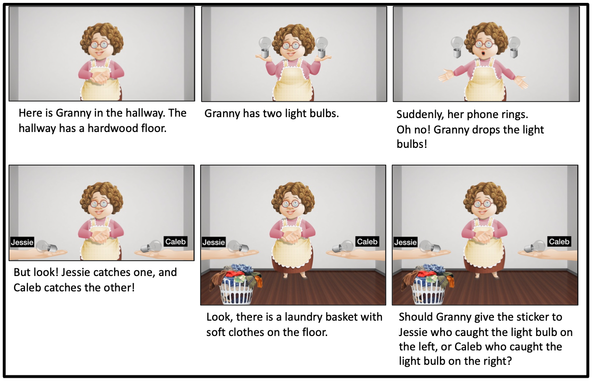

# Counterfactual reasoning without counterfactual language

This repository contains the experiments, data, analyses, and figures for the paper "Counterfactual reasoning without counterfactual language," by David Rose, Siying Zhang, Hyo Gweon and Tobias Gerstenberg.

<!-- The preprint can be found [here](update link) -->

__Contents__:
- [Introduction](#Introduction)
- [Repository structure](#Repository-structure)

## Introduction



<br clear="left" />
<br clear="right" />

Counterfactual reasoning---reasoning about what did not happen, but might have---is a fundamental cognitive capacity. The development of counterfactual reasoning is linked to, among other things, understanding causation, pretense, rules, and mental states. Estimates of when
children’s capacity for counterfactual thinking develops range from as early as 2 to as late as 12 and virtually everywhere
between. We suggest that this is, in part, due to relying on counterfactual language to proper counterfactual thinking. We develop a paradigm for probing counterfactual thinking that doesn't rely on counterfactual language, and that can distinguish hypothetical from counterfactual reasoning. Using this paradigm, we find, in Experiment~1, that three-year old children can engage in hypothetical reasoning. Building on our paradigm, we find in Experiment~2, that by around 6, children show signs of engaging in counterfactual reasoning. Nothing that this might be explained by children instead engaging in hypothetical reasoning, we extend our paradigm in Experiment~3, to develop a more stringent test. We find that around 6, children engage in counterfactual reasoning. Our findings suggest that the capacity to engage in counterfactual reasoning may build on the capacity to engage in hypothetical reasoning.  


## Repository structure

```
├── code
│   ├── R
│   ├── experiments
│   │   ├── experiment1
│   │   ├── ...
├── data
│   ├── experiment1
│   ├── experiment2
│   └── experiment3
├── docs
│   ├── experiment1
│   ├── experiment2
│   └── experiment3
├── figures
│   ├── experiment1
│   ├── experiment2
│   └── experiment3


```

- `code/` contains all the code for the experiments, analyzing data and generating figures.
  - `experiments` contains code for each experiment that was run. Pre-registrations for all experiments may be accessed via the Open Science Framework [here](UPDATE). All experiments with adults were run in jsPsych and all experiments with children were run in Lookit. 
	- `experiment1` 
		- adults ([pre-registration](https://osf.io/yqvfz)) 
		- children ([pre-registration](https://osf.io/sdbx7)) 
	- `experiment2` 
		- adults ([pre-registration](https://osf.io/ytjsp)) 
		- children ([pre-registration](https://osf.io/r52dt))
	- `experiment3` 
		- adults ([pre-registration](https://osf.io/mwb9e)) 
		- children ([pre-registration](https://osf.io/e8pqt))  	 
- `R` contains the analysis scripts that were used to analyze data and generate figures
	 (view a rendered file [here](https://davdrose.github.io/counterfactual_dev/)).
- `data/` contains anonymized data from all experiments
- `docs/` contains all the experiment code for the adult versions of each experiment. You can preview the experiments below:
	- [experiment1](https://davdrose.github.io/counterfactual_dev//experiment1/index.html),
	- [experiment2](https://davdrose.github.io/counterfactual_dev//experiment2/index.html),
	- [experiment3](https://davdrose.github.io/counterfactual_dev//experiment3/index.html)
- `figures/` contains all the figures from the paper (generated using the script in `code/R/`). 
